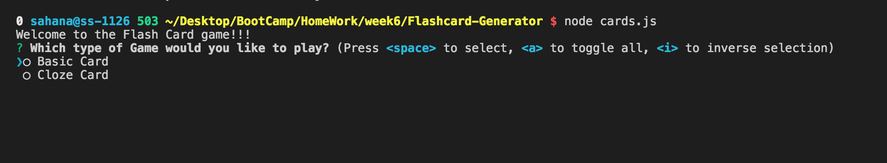

# Flashcard-Generator
A backend flash card game developed using Node.js

## Walk Through
This card game is a backend version. When the user runs the game they would be given with two choices for either a Basic Card or a Cloze card. 

If the user selects to play Basic Card or Cloze Card each question will be displayed and the user has to type in the correct answer. If the user enters the correct answer there score will increase by one, if they enter an incorrect answer unforutnately there score will not increase and the correct answer will get displayed. 

In the Cloze card the answer will be represented as ...

## Techonlogies Used

- Inquirer : https://www.npmjs.com/package/inquirer

